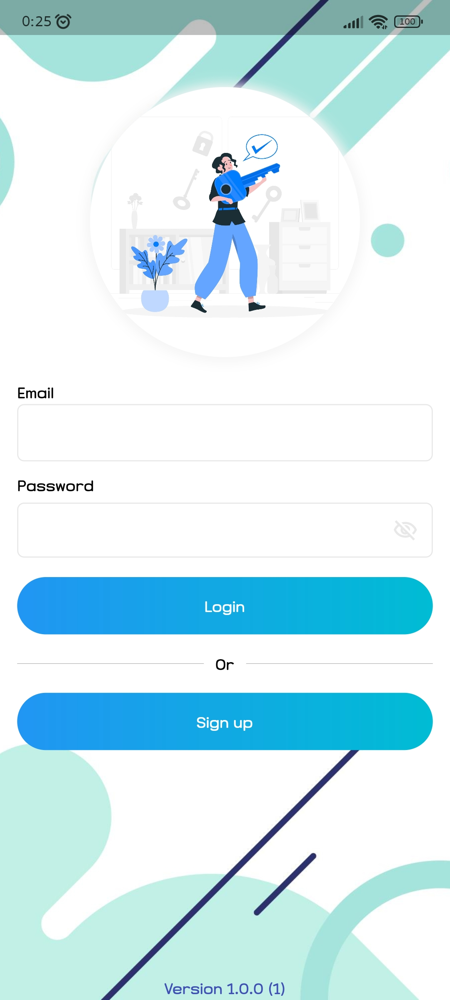
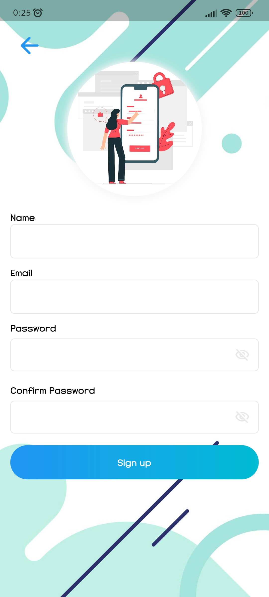
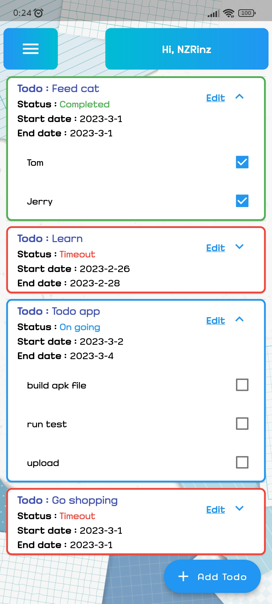

# My Todo App (Flutter)
## By Wirayut Chuensaen

### Package used :
- firebase_auth
- firebase_core
- cloud_firestore
- firebase_crashlytics
- firebase_analytics
- flutter_easyloading
- shared_preferences
- intl
- package_info_plus
- flutter_launcher_icons

Image assets by [freepik.com](https://www.freepik.com/)

Font used : [MN-Buri](https://www.f0nt.com/release/mn-buri)
### Features :
- Authenticate by Firebase Auth. (Login, Sign up and reset password)
- Add, edit and delete todo data.
- Check todo task [✔]
- Display todo status. (On going, Completed and Timeout)
### Some screenshots :

### Other links :
- [Full information](https://wirayut-chuensaen.github.io/WorksPage)

- [APK 1.0.0(1)](https://drive.google.com/file/d/1sC3cpS2DNlcn-sXbUo77BwRwh-f6IxUH/view?usp=sharing)

- This project studied the basic Firebase structure and code from [madhank93/todo-list-flutter-firebase](https://github.com/madhank93/todo-list-flutter-firebase)